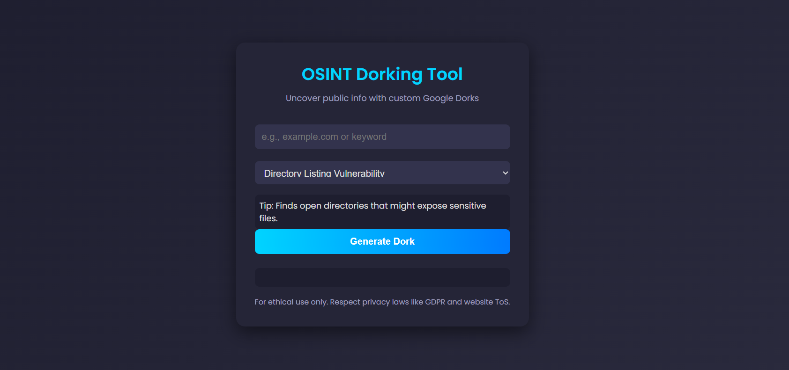

# OSINT Dorking Tool

A simple, modern web-based tool to generate Google Dorks for Open-Source Intelligence (OSINT) research. I created this tool with the help of Grok, an AI assistant by xAI, by providing detailed instructions and feedback to implement my vision for an ethical OSINT research tool.

## Features
- **Wide Range of Dorks**: Supports over 90 Google Dork queries across categories like vulnerabilities, files/documents, sensitive information, domain discovery, external searches, and specific technologies.
- **Instant Tips**: Displays a helpful tip for each dork type as soon as you select it (e.g., "Finds open directories that might expose sensitive files" for Directory Listing Vulnerability).
- **Modern Design**: Clean, dark-themed UI with cyan accents, smooth animations, and a responsive layout.
- **Larger Dork Text**: Generated dorks are displayed in a larger font for better readability.
- **Ethical Use Disclaimer**: Includes a reminder to use the tool responsibly and respect privacy laws (e.g., GDPR, CCPA) and website terms of service.

## Demo
Try the live version of the tool here: [OSINT Dorking Tool Live Demo](https://lunaticjohn.github.io/Osint-dork-tool-2025/)

## Screenshots
  

## Usage
1. **Enter a Target**: Input a domain or keyword (e.g., `nasa.gov` or `tesla.com`) in the text field.
2. **Select a Dork Type**: Choose a dork category from the dropdown (e.g., "Directory Listing Vulnerability"). A tip will appear immediately to explain what the dork does.
3. **Generate the Dork**: Click the "Generate Dork" button to create a Google Dork query.
4. **Search on Google**: Click the generated dork link to run the search on Google.

### Example
- **Target**: `nasa.gov`  
- **Dork Type**: Directory Listing Vulnerability  
- **Tip (on selection)**: "Finds open directories that might expose sensitive files."  
- **Generated Dork**: `intitle:"index of" site:nasa.gov`  
- **Action**: Click the dork to search Google for open directories on `nasa.gov`.

## Installation
You can either use the tool directly via a live demo (if hosted) or run it locally by following these steps:

### Option 1: Use the Live Demo
- Visit the live demo link: [OSINT Dorking Tool Live Demo](https://lunaticjohn.github.io/Osint-dork-tool-2025/) 

### Option 2: Run Locally
1. **Clone the Repository**:
   ```bash
   git clone https://github.com/your-username/osint-dorking-tool.git
